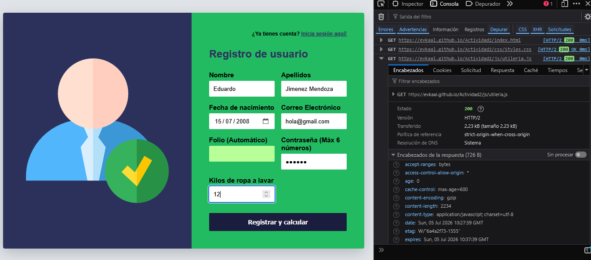
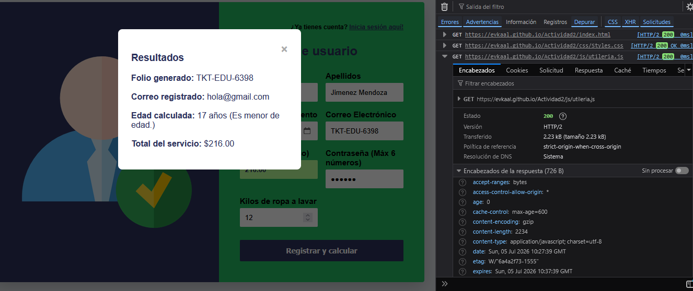
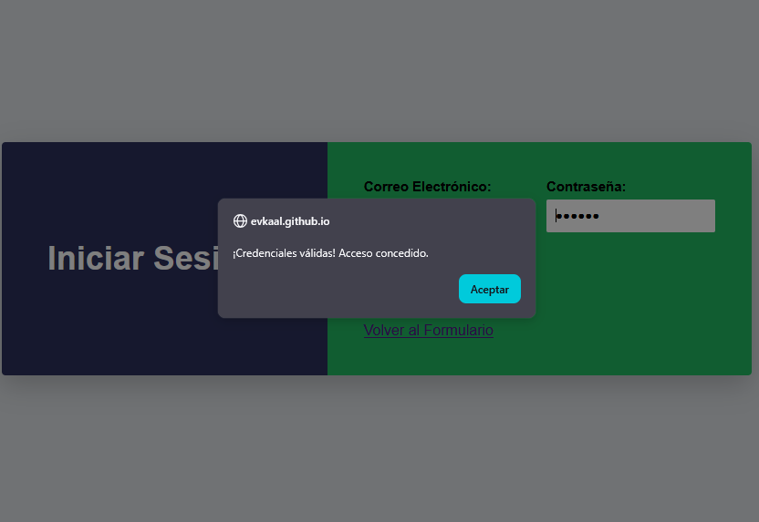

**Nombre:** Jiménez Mendoza Eduardo

---

## ¿Qué problema resuelve?

Esta librería proporciona un conjunto de utilidades desarrolladas en **JavaScript puro** para validar los datos de entrada en formularios web de registro.

Su objetivo es evitar el ingreso de datos erróneos, como:

- Correos electrónicos con formato incorrecto.
- Contraseñas que no cumplen con los requisitos establecidos.
- Edades inválidas o mal calculadas.

Además, incorpora funciones orientadas al negocio para automatizar el cálculo de precios y la generación de folios de tickets, agilizando la atención al cliente sin depender de frameworks o librerías externas.

---

## Instalación

No requiere **Node.js**, gestores de paquetes ni dependencias externas.

Simplemente se descarga el archivo `utileria.js` y se inclúye en el documento HTML dentro de la etiqueta `<head>`.

```html
<script src="js/utileria.js"></script>
```

---

# Uso y ejemplos

A continuación se muestran algunos ejemplos de cómo utilizar las funciones de la librería.

## 1. Validación de correo electrónico

Evalúa si la cadena de texto ingresada tiene un formato válido de correo electrónico.

```javascript
let esValido = Correo("ejemplo@gmail.com");

console.log(esValido);
// Retorna: true
```

---

## 2. Validación de contraseña (PIN numérico)

Valida que la contraseña:

- Contenga únicamente números.
- Tenga un máximo de 6 dígitos.

```javascript
let passValida = validarPassword("123456");

console.log(passValida);
// Retorna: true
```

---

## 3. Cálculo de edad

Calcula la edad exacta de una persona a partir de su fecha de nacimiento.

```javascript
let edadCliente = calcularEdad("2003-10-30");

console.log("El cliente tiene: " + edadCliente + " años");
```

---

## 4. Funciones de negocio

### Calcular total de lavandería

Calcula el costo del servicio aplicando automáticamente un **10% de descuento** cuando el peso supera los **10 kg**.

```javascript
let totalCosto = calcularTotalLavanderia(12, 20);

console.log("Total a cobrar: $" + totalCosto);
// Retorna: 216
```

---

### Generar folio de ticket

Genera un identificador único para el ticket utilizando el nombre del cliente.

```javascript
let miFolio = generarFolioTicket("Eduardo");

console.log("Folio generado: " + miFolio);
// Ejemplo de salida:
// TKT-EDU-5432
```

---

# Funciones incluidas

| Función | Descripción |
|----------|-------------|
| `Correo(correo)` | Valida el formato de un correo electrónico. |
| `validarPassword(password)` | Verifica que el PIN sea numérico y tenga como máximo 6 dígitos. |
| `calcularEdad(fechaNacimiento)` | Calcula la edad a partir de una fecha de nacimiento. |
| `calcularTotalLavanderia(kilos, precioKilo)` | Calcula el costo total aplicando descuentos cuando corresponde. |
| `generarFolioTicket(nombre)` | Genera un folio único para los tickets de servicio. |

---

# Requisitos

- Navegador web moderno.
- JavaScript habilitado.
- No requiere frameworks.
- No requiere instalación de dependencias.

---
## Captura del formulario




