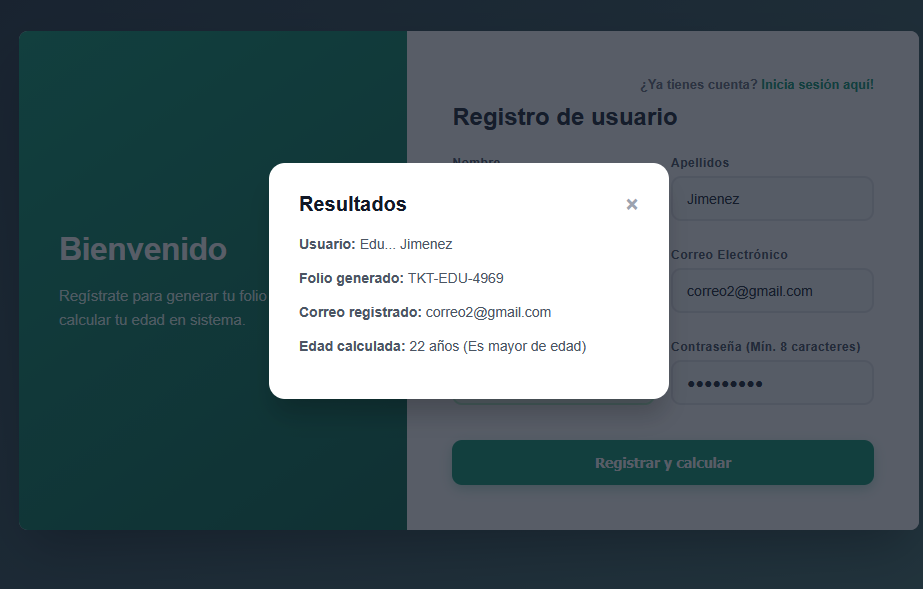
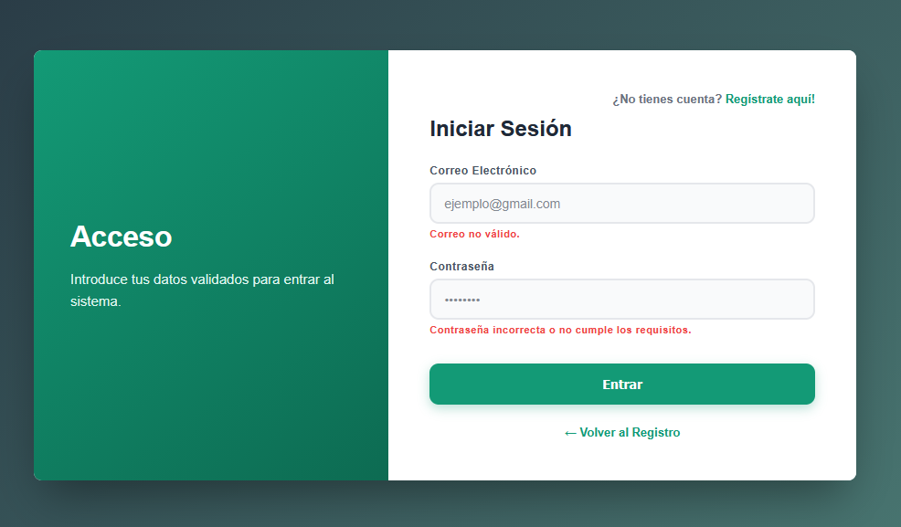
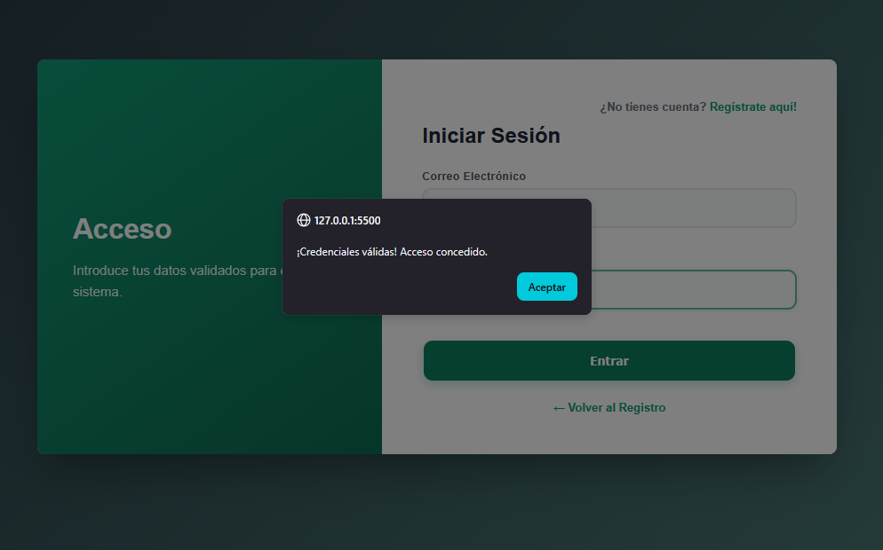

**Nombre:** Jiménez Mendoza Eduardo
**Materia:** Programación web

---

## ¿Qué problema resuelve?

Esta librería proporciona un conjunto de utilidades desarrolladas en **JavaScript puro** para validar los datos de entrada en un formulario web de **registro** e **inicio de sesión**.

Su objetivo es evitar el ingreso de datos erróneos, como:

- Nombres o apellidos con caracteres inválidos.
- Correos electrónicos con formato incorrecto.
- Contraseñas que no cumplen con los requisitos establecidos.
- Fechas de nacimiento vacías o mal calculadas.

Además, incorpora funciones orientadas al negocio para automatizar el **cálculo de la edad**, la **generación de folios de usuario** y el **recorte de textos largos**, agilizando el registro de clientes sin depender de frameworks o librerías externas.

---

## Instalación

No requiere **Node.js**, gestores de paquetes ni dependencias externas.

Simplemente se descarga el archivo `utileria.js` y se incluye en el documento HTML dentro de la etiqueta `<head>`, antes de usar sus funciones:

```html
<script src="js/utileria.js"></script>
```

---

# Uso y ejemplos

A continuación se muestran algunos ejemplos de cómo utilizar las funciones de la librería.

## 1. Validación de correo electrónico

Evalúa si la cadena de texto ingresada tiene un formato válido de correo electrónico.

```javascript
function validarCorreo(correo) {
    const regular = /^[^\s@]+@[^\s@]+\.[^\s@]+$/;
    return regular.test(correo);
}
```

---

## 2. Solo letras

Verifica que la cadena contenga únicamente letras (incluyendo vocales acentuadas y la letra "ñ") y espacios, útil para validar nombres y apellidos.

```javascript
function soloLetras(texto) {
    const regex = /^[a-zA-ZáéíóúÁÉÍÓÚñÑ\s]+$/;
    return regex.test(texto);
}
```

---

## 3. Validación de longitud

Verifica que un valor (numérico o de texto) no exceda una longitud máxima de caracteres.

```javascript
function validarLongitud(numero, maxLongitud) {
    let textoNum = numero.toString();
    return textoNum.length <= maxLongitud;
}
```

---

## 4. Cálculo de edad

Calcula la edad exacta de una persona a partir de su fecha de nacimiento, tomando en cuenta si ya cumplió años en el mes y día actuales.

```javascript
function calcularEdad(fechaNacimiento) {
    const hoy = new Date();
    const fechaNac = new Date(fechaNacimiento);
    let edad = hoy.getFullYear() - fechaNac.getFullYear();
    const mes = hoy.getMonth() - fechaNac.getMonth();

    if (mes < 0 || (mes === 0 && hoy.getDate() < fechaNac.getDate())) {
        edad--;
    }
    return edad;
}
```

---

## 5. Verificar si es mayor de edad

Utiliza `calcularEdad` para determinar si una persona es mayor de edad (18 años o más).

```javascript
function esMayorDeEdad(fechaNacimiento) {
    const edad = calcularEdad(fechaNacimiento);
    return edad >= 18;
}
```

---

## 6. Validación de contraseña

Valida que la contraseña:

- Contenga al menos una letra minúscula y una mayúscula.
- Contenga al menos un número.
- Contenga al menos un carácter especial (`@$!%*?&.#_-+=`).
- Tenga un mínimo de 8 caracteres.

```javascript
function validarPassword(password) {
    const regex = /^(?=.*[a-z])(?=.*[A-Z])(?=.*\d)(?=.*[@$!%*?&.#_\-+=])[A-Za-z\d@$!%*?&.#_\-+=]{8,}$/;
    return regex.test(password);
}
```

---

## 7. otras funciones

### Generar folio de usuario

Genera un identificador único a partir del nombre del cliente, tomando sus 3 primeras letras como prefijo y un número aleatorio de 4 dígitos.

```javascript
function generarFolioTicket(nombreCliente) {
    let prefijo = "CLI";
    if (nombreCliente && nombreCliente.length >= 3) {
        prefijo = nombreCliente.substring(0, 3).toUpperCase();
    }
    const aleatorio = Math.floor(Math.random() * 9000) + 1000;
    return `TKT-${prefijo}-${aleatorio}`;
}
```

### Truncar texto

Recorta un texto a un límite de caracteres dado y agrega puntos suspensivos si fue recortado.

```javascript
function truncarTexto(texto, limite) {
    if (!texto) return "";
    if (texto.length <= limite) return texto;
    return texto.substring(0, limite).trim() + '...';
}
```

---

## 8. Procesamiento del formulario

`ProcesarFormulario()` es la función principal que se ejecuta al enviar el formulario de registro (`index.html`). Realiza lo siguiente:

1. Obtiene los valores de nombre, apellidos, fecha de nacimiento, correo y contraseña.
2. Limpia los mensajes de error previos.
3. Valida cada campo usando `soloLetras`, `validarCorreo` y `validarPassword`, mostrando el error correspondiente debajo de cada campo si falla.
4. Si no hay errores, calcula la edad, determina si es mayor de edad, genera el folio y lo coloca automáticamente en el campo "Folio".
5. Muestra un resumen de los resultados (usuario, apellidos, folio, correo y edad) dentro de un modal (`#miModal`).

```javascript
function ProcesarFormulario() {
    // Obtiene datos del formulario, valida y muestra resultados en un modal
}
```


---

# Funciones incluidas

| Función | Descripción |
|----------|-------------|
| `validarCorreo(correo)` | Valida el formato de un correo electrónico. |
| `soloLetras(texto)` | Valida que el texto contenga solo letras, espacios y acentos. |
| `validarLongitud(numero, maxLongitud)` | Valida que un valor no exceda una longitud máxima. |
| `calcularEdad(fechaNacimiento)` | Calcula la edad a partir de una fecha de nacimiento. |
| `esMayorDeEdad(fechaNacimiento)` | Valida si una persona es mayor de edad. |
| `validarPassword(password)` | Valida que la contraseña cumpla los requisitos de seguridad. |
| `generarFolioTicket(nombre)` | Genera un folio único para el registro del usuario. |
| `truncarTexto(texto, limite)` | Recorta un texto y agrega puntos suspensivos si excede el límite. |


---

# Requisitos

- Navegador web moderno.
- JavaScript habilitado.
- No requiere frameworks.
- No requiere instalación de dependencias.

---

## Captura del formulario

Errores que se muestra en cada input

Resultados con los datos correctos

Errores en el login

Resultado con los datos correctos del login



## Video demostrativo

https://drive.google.com/drive/folders/1Wp5BNng3wgo5TqeG4cbvg_voN0hgousq?usp=sharing